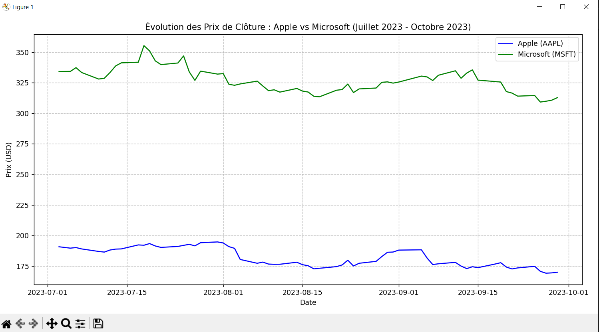

# 📊 Comparaison de l’Évolution des Prix de Deux Actions

## 📌 Objectif  
Comparer les performances de deux actions (ex: Apple vs Microsoft) sur les 3 derniers mois en utilisant Python.

## 🛠️ Technologies  
- Python (Pandas, Matplotlib, yfinance)  
- Yahoo Finance API  

## 📦 Installation  
1. Clonez le repository :  
   ```bash  
   git clone https://github.com/NADIAELQ/actions_comparing.git 

2. Installez les dépendances :
   ```bash  
   pip install -r requirements.txt  

## 🚀 Exécution
   ```bash  
   py projet_actions.py

## 📊 Résultats



Performance entre 2023-07-01 et 2023-10-01 :
- Apple : -10.92%
- Microsoft : -6.38%

Conclusion : Microsoft a mieux performé que Apple.